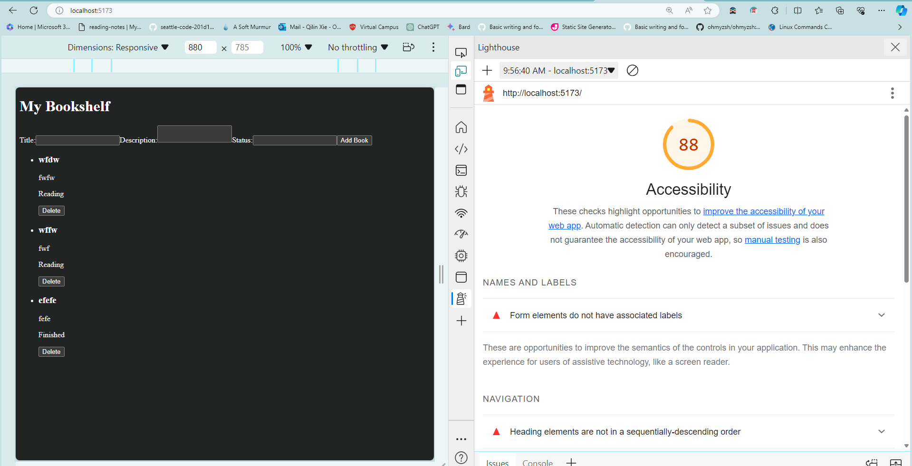
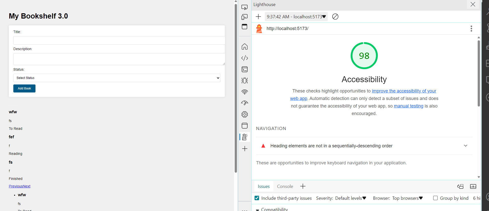
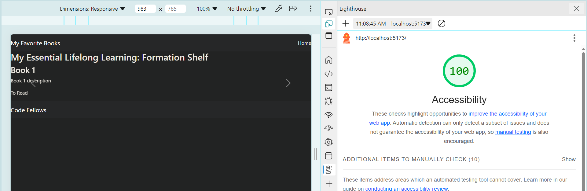

# Start your own "Can of Books" App

This repository has starter code to begin work on creating your own online bookshelf.

## What can books do?

Books are life-changing. They have the power to enlighten, educate, entertain, heal, and help us grow. Build out this code base to create an web app to track what books have impacted you, and what's recommended to read next.

## Use this template

Clone this repo to your own account with the green "Use this template" button. Then, add any collaborators. Now you are ready to start adding features! Deploy your site to let the world know which books have had the greatest impact on you, and what's recommended. Enjoy!

# Project Name

**Author**: Qilin Xie and Ryan Potts
**Version**: 1.0.0 (increment the patch/fix version number if you make more commits past your first submission)

## Overview
Books are life-changing. They have the power to enlighten, educate, entertain, heal, and help us grow. Can of Books API is the back end portion of Can of Books. It handles any database calls.

## Getting Started
Git 

## Architecture
JavaScript, Express, Cors, Dotenv, MongoDB

## Accessibility lab 12: 

## Accessibility lab 13: 

## Change Log
Qilin's log PST
4/12 9:15am debugs old files

Qilin's log PST
4/10 1:13pm backend: adds update features(modifies books.js)
front end: adds EditBookForm.jsx, updates app.jsx 
3pm modularizes some stuff for back end and fixes front end edit button (it isnt displaying correctly on site but jsut need to debug a little bit)

Qilin's log PST 
4/9/24 8:40 modifies database URL for front end and modified js files
4/9/24 11am fixes small bug on front end BestBooks.jsx
3pm addes create and delete files for backend
4pm worked on front end jsx files for create and delte files
5:30pm last ACP for the day (unfixed bugs)
4/10 10am fixes bugs(bakc end: port issues, front end app.jsx and AddBookForm.jsx implementation)
updates readme

Qilin's log PST 
4/8/2024 1:30pm initalzies and clones backend anbd frontend repo template 
2pm modifies and adds files for project setup
3:30pm ACP back end for deployment
5:30pm ACP front end for deployment

## Estimates

Time Estimates
For each of the lab features, make an estimate of the time it will take you to complete the feature, and record your start and finish times for that feature:

lab 12

1. Name of feature: Update

Estimate of time needed to complete: 50 mins

Start time: 

Finish time: 

Actual time needed to complete: 

lab 11

1. Name of feature: Create

Estimate of time needed to complete: 40 mins

Start time: 12:30pm

Finish time: 1:10

Actual time needed to complete: 40mins

2. Name of feature: Delete component

Estimate of time needed to complete: 40 mins

Start time: 2pm

Finish time: 5:00pm

Actual time needed to complete: probably 1 hr and half but it isnt rendering correctly on the site yet

lab 10
1. Name of feature: Storage

Estimate of time needed to complete: 1 hr

Start time: 2:20p,

Finish time: 3pm

Actual time needed to complete: 40mins

2. Name of feature: Book component

Estimate of time needed to complete: 40 mins

Start time: 3:45pm

Finish time: 5:00pm

Actual time needed to complete: 1 hr 15 mins

## Acessibiltiy scores:

## Credit and Collaborations
ChatGPT helped with this project.

# Collaboration Agreement

## Logistical
- **Communication Hours:**
  - Qilin: 8am - 4:30 pm PST
  - Ryan: 11am - 8pm Central time
  - Lunch break: When class is over, around 12ish - 1pm PST or whenever decided.

- **Communication Platform:**
  - Slack (downloaded on phone) and Remo.

- **Breaks:**
  - Take breaks every 2 hours, and communicate if needed.

- **Fallback Plan:**
  - Seek TA help or assistance from John if falling behind.

## Cooperative
- **Strengths:**
  - Ryan: Project setups and deployments, HTML, CSS, understanding project requirements.
  - Qilin: JavaScript, organization.

- **Utilizing Strengths:**
  - Utilize Ryan's strengths in project setups and deployments.
  - Qilin can explain JavaScript syntax and utilize organizational skills.

- **Areas for Development:**
  - Ryan: JavaScript.
  - Qilin: Debugging, deployments, project setups.

- **Approach to Understanding Code:**
  - Discuss concepts regularly, ensure mutual understanding of code.
  - Encourage asking questions, maintain open communication.

## Conflict Resolution
- **Uneven Workload:**
  - Alternate roles between drivers and navigators.

- **One Person Dominating:**
  - Address openly, seek TA assistance if needed.

- **Skill Level Disparity:**
  - Practice patience and understanding, adjust communication as needed.
